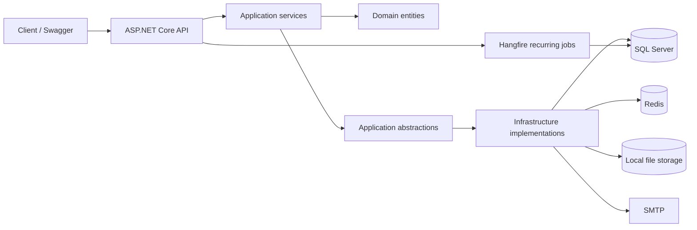

# CRM API

CRM API is a backend service for managing customers, orders, users, authentication, and order attachments. The application is built with ASP.NET Core and follows a layered architecture with separate API, Application, Domain, and Infrastructure projects.

## Features

- JWT authentication with access and refresh tokens
- Refresh token rotation and logout token revocation
- Password reset flow with SMTP email delivery
- Role-based authorization with `SuperAdmin`, `Admin`, and `Manager` roles
- Customer CRUD
- Order creation, listing, filtering, and sorting
- Customer order history
- File attachments for orders
- Pagination for collection endpoints
- Global exception handling with `ProblemDetails` responses
- Request validation with FluentValidation
- Rate limiting for authentication and authenticated API endpoints
- SQL Server persistence with Entity Framework Core migrations
- Distributed cache abstraction with Redis support outside Development
- Hangfire recurring job for expired token cleanup
- Structured logging with Serilog
- Docker and Docker Compose setup
- Integration tests with xUnit, Testcontainers, SQL Server, and Redis
- GitHub Actions workflow for restore, build, and test

## Tech stack

| Area | Technology |
| --- | --- |
| Runtime | .NET 10, ASP.NET Core Web API |
| Database | SQL Server |
| ORM | Entity Framework Core |
| Authentication | JWT Bearer authentication |
| Authorization | ASP.NET Core policy-based authorization |
| Validation | FluentValidation |
| Caching | `IDistributedCache`, Redis |
| Background jobs | Hangfire with SQL Server storage |
| Logging | Serilog |
| API documentation | OpenAPI, Swagger UI |
| Containers | Docker, Docker Compose |
| Testing | xUnit, FluentAssertions, Testcontainers |
| CI | GitHub Actions |

## Architecture

```text
CRM API
├── Api
│   ├── Controllers
│   ├── Authentication and authorization setup
│   ├── Rate limiting
│   ├── OpenAPI / Swagger configuration
│   └── Global exception handling
├── Application
│   ├── DTOs
│   ├── Services
│   ├── Validators
│   ├── Abstractions
│   └── Application exceptions
├── Domain
│   ├── Customer
│   ├── Order
│   ├── OrderAttachment
│   ├── User
│   ├── RefreshToken
│   ├── PasswordResetToken
│   └── UserRole
└── Infrastructure
    ├── EF Core DbContext
    ├── Migrations
    ├── SQL Server persistence
    ├── JWT service
    ├── Distributed cache implementation
    ├── SMTP email sender
    ├── Local file storage
    └── Hangfire jobs
```



## Project structure

```text
.
├── Api/                    # Web API entry point, controllers, middleware setup
├── Application/            # Use cases, DTOs, validators, service abstractions
├── Domain/                 # Domain entities and roles
├── Infrastructure/         # Database, migrations, external service implementations
├── Api.IntegrationTests/   # Integration tests with Testcontainers
├── Dockerfile
├── docker-compose.yaml
├── docker-compose.dev.yaml
└── CRM.slnx
```

## Getting started

### Requirements

- .NET 10 SDK
- Docker and Docker Compose
- SQL Server, or the SQL Server container from Docker Compose
- Redis, or the Redis container from Docker Compose

### Run with Docker Compose

Create a local environment file from the example:

```bash
cp .env.example .env
```

Update the values in `.env`:

```env
MSSQL_SA_PASSWORD=change-me-strong-password
SQLSERVER_DB=CrmDb
JWT_KEY=change-me-long-secret-key-at-least-32-chars
JWT_ISSUER=crm-api
JWT_AUDIENCE=crm-client
SEED_SUPERADMIN_EMAIL=superadmin@crm.local
SEED_SUPERADMIN_PASSWORD=change-me
AUTH_ACCESS_TOKEN_LIFETIME=00:10:00
AUTH_REFRESH_TOKEN_LIFETIME=00:30:00
AUTH_TOKEN_CLOCK_SKEW=00:00:30
```

Start the full stack:

```bash
docker compose up --build
```

Docker Compose starts:

- SQL Server on `localhost:14333`
- Redis on `localhost:6379`
- API on `http://localhost:5144`
- automatic database migration container before API startup

Swagger UI is available in Development mode:

```text
http://localhost:5144/swagger
```

### Run infrastructure only

Use the development compose file when running the API directly from the .NET CLI:

```bash
docker compose -f docker-compose.dev.yaml up -d
```

This starts:

- SQL Server on `localhost:14333`
- Redis on `localhost:6379`
- Mailpit SMTP on `localhost:1025`
- Mailpit web UI on `http://localhost:8025`

Apply migrations:

```bash
dotnet tool restore --tool-manifest Api/dotnet-tools.json
dotnet ef database update \
  --project Infrastructure/Infrastructure.csproj \
  --startup-project Api/Api.csproj
```

Run the API:

```bash
dotnet run --project Api/Api.csproj
```

Local HTTPS and Swagger URLs are defined in `Api/Properties/launchSettings.json`.

## Configuration

Configuration is provided through `appsettings.json`, `appsettings.Development.json`, environment variables, and Docker Compose variables.

### Connection strings

```json
{
  "ConnectionStrings": {
    "DefaultConnection": "Server=localhost,14333;Database=CrmDb;User Id=sa;Password=your-password;Encrypt=True;TrustServerCertificate=True;",
    "Redis": "localhost:6379"
  }
}
```

### JWT

```json
{
  "Jwt": {
    "Key": "change-me-long-secret-key-at-least-32-chars",
    "Issuer": "crm-api",
    "Audience": "crm-client"
  }
}
```

### Token lifetime

```json
{
  "Auth": {
    "AccessTokenLifetime": "00:10:00",
    "RefreshTokenLifetime": "00:30:00",
    "TokenClockSkew": "00:00:30"
  }
}
```

### Password reset

```json
{
  "PasswordReset": {
    "FrontendBaseUrl": "http://localhost:5173",
    "TokenLifetime": "00:30:00"
  }
}
```

### SMTP email

```json
{
  "Email": {
    "Smtp": {
      "Host": "localhost",
      "Port": 1025,
      "User": "",
      "Password": "",
      "From": "no-reply@crm.local",
      "Enabled": true
    }
  }
}
```

### File storage

```json
{
  "FileStorage": {
    "RootPath": "../crm-uploads",
    "MaxFileSizeBytes": 5242880,
    "AllowedExtensions": [".pdf", ".png", ".jpg", ".jpeg"]
  }
}
```

## Authentication

### Login

```http
POST /api/auth/login
Content-Type: application/json

{
  "email": "superadmin@crm.local",
  "password": "change-me"
}
```

Response:

```json
{
  "access_token": "eyJhbGciOi...",
  "refresh_token": "base64-refresh-token"
}
```

Use the access token in authenticated requests:

```http
Authorization: Bearer <access_token>
```

### Refresh token

```http
POST /api/auth/refresh
Content-Type: application/json

{
  "refresh_token": "base64-refresh-token"
}
```

The refresh endpoint rotates the refresh token and returns a new access/refresh token pair.

### Logout

```http
POST /api/auth/logout
Content-Type: application/json

{
  "refresh_token": "base64-refresh-token"
}
```

### Forgot password

```http
POST /api/auth/forgot-password
Content-Type: application/json

{
  "email": "user@example.com"
}
```

### Reset password

```http
POST /api/auth/reset-password
Content-Type: application/json

{
  "token": "password-reset-token",
  "newPassword": "NewPassword123!"
}
```

## Authorization

| Role | Customers | Orders | Users | Create Admin |
| --- | --- | --- | --- | --- |
| `SuperAdmin` | Yes | Yes | Yes | Yes |
| `Admin` | Yes | Yes | Yes | No |
| `Manager` | Yes | Yes | No | No |

A bootstrap `SuperAdmin` user is created from the configured `Seed:SuperAdmin` values when the database is initialized.

## API overview

### Auth

| Method | Endpoint | Description | Auth |
| --- | --- | --- | --- |
| `POST` | `/api/auth/login` | Authenticate user | Public |
| `POST` | `/api/auth/refresh` | Rotate refresh token | Public |
| `POST` | `/api/auth/logout` | Revoke refresh token | Public |
| `POST` | `/api/auth/forgot-password` | Request password reset email | Public |
| `POST` | `/api/auth/reset-password` | Reset password | Public |

### Customers

| Method | Endpoint | Description | Roles |
| --- | --- | --- | --- |
| `GET` | `/api/customers` | List customers | SuperAdmin, Admin, Manager |
| `GET` | `/api/customers/{id}` | Get customer by ID | SuperAdmin, Admin, Manager |
| `GET` | `/api/customers/{id}/orders` | List orders for a customer | SuperAdmin, Admin, Manager |
| `POST` | `/api/customers` | Create customer | SuperAdmin, Admin, Manager |
| `PUT` | `/api/customers/{id}` | Replace customer | SuperAdmin, Admin, Manager |
| `PATCH` | `/api/customers/{id}` | Partially update customer | SuperAdmin, Admin, Manager |
| `DELETE` | `/api/customers/{id}` | Delete customer | SuperAdmin, Admin, Manager |

### Orders

| Method | Endpoint | Description | Roles |
| --- | --- | --- | --- |
| `GET` | `/api/orders` | List orders | SuperAdmin, Admin, Manager |
| `GET` | `/api/orders/{id}` | Get order by ID | SuperAdmin, Admin, Manager |
| `POST` | `/api/orders` | Create order | SuperAdmin, Admin, Manager |
| `POST` | `/api/orders/{orderId}/attachments` | Upload order attachment | SuperAdmin, Admin, Manager |
| `GET` | `/api/orders/{orderId}/attachments` | List order attachments | SuperAdmin, Admin, Manager |
| `GET` | `/api/orders/{orderId}/attachments/{attachmentId}/download` | Download attachment | SuperAdmin, Admin, Manager |
| `DELETE` | `/api/orders/{orderId}/attachments/{attachmentId}` | Delete attachment | SuperAdmin, Admin, Manager |

### Users

| Method | Endpoint | Description | Roles |
| --- | --- | --- | --- |
| `GET` | `/api/users` | List users visible to current user | SuperAdmin, Admin |
| `GET` | `/api/users/{targetUserId}` | Get user by ID | SuperAdmin, Admin |
| `POST` | `/api/users/manager` | Create manager | SuperAdmin, Admin |
| `POST` | `/api/users/admin` | Create admin | SuperAdmin |
| `DELETE` | `/api/users/{targetUserId}` | Delete user | SuperAdmin, Admin |

## Request examples

### Create customer

```http
POST /api/customers
Authorization: Bearer <access_token>
Content-Type: application/json

{
  "name": "Acme Corp",
  "email": "contact@acme.com"
}
```

### List customers

```http
GET /api/customers?page=1&pageSize=10&search=acme&sortBy=name&sortDirection=asc
Authorization: Bearer <access_token>
```

### Create order

```http
POST /api/orders
Authorization: Bearer <access_token>
Content-Type: application/json

{
  "customerId": 1,
  "totalAmount": 1499.99
}
```

### List orders with filters

```http
GET /api/orders?page=1&pageSize=10&customerId=1&minTotalAmount=100&sortBy=createdAt&sortDirection=desc
Authorization: Bearer <access_token>
```

### Upload attachment

```bash
curl -X POST "http://localhost:5144/api/orders/1/attachments" \
  -H "Authorization: Bearer <access_token>" \
  -F "file=@invoice.pdf"
```

## Pagination and sorting

Collection endpoints return a paged response:

```json
{
  "items": [],
  "page": 1,
  "pageSize": 10,
  "totalCount": 0,
  "totalPages": 0,
  "hasNextPage": false,
  "hasPreviousPage": false
}
```

Common query parameters:

| Parameter | Description |
| --- | --- |
| `page` | Page number, default `1` |
| `pageSize` | Number of items per page, default `10` |
| `sortBy` | Field name used for sorting |
| `sortDirection` | `asc` or `desc` |

Customer-specific filters:

| Parameter | Description |
| --- | --- |
| `search` | Searches customers by name or email |

Order-specific filters:

| Parameter | Description |
| --- | --- |
| `customerId` | Filters orders by customer |
| `minTotalAmount` | Minimum order amount |
| `maxTotalAmount` | Maximum order amount |
| `createdFrom` | Start date/time filter |
| `createdTo` | End date/time filter |

## Rate limiting

The API uses two rate-limit policies:

| Policy | Scope | Limit |
| --- | --- | --- |
| `auth` | Authentication endpoints, partitioned by IP | 5 requests per 5 minutes |
| `user-api` | Authenticated API endpoints, partitioned by user ID or IP | 60 requests per minute |

Rate-limit responses use HTTP `429 Too Many Requests` and return a `ProblemDetails` response body.

## Background jobs

Hangfire is configured for recurring background processing. The current recurring job is:

| Job | Schedule | Description |
| --- | --- | --- |
| `auth-token-cleanup` | Daily at 03:00 UTC | Removes expired refresh tokens and old password reset tokens |

The Hangfire Dashboard is enabled in Development:

```text
/hangfire
```

## Caching

The application uses a cache-aside approach through an application-level cache abstraction.

Cached endpoints:

- `GET /api/customers/{id}`
- `GET /api/orders/{id}`

Customer cache entries are invalidated after:

- `PUT /api/customers/{id}`
- `PATCH /api/customers/{id}`
- `DELETE /api/customers/{id}`

In Development, the application uses distributed memory cache. Outside Development, Redis is required through `ConnectionStrings:Redis`.

## Logging and errors

Serilog is configured for structured logging to console and rolling files.

Implemented logging and error handling:

- HTTP request logging
- centralized exception handling
- `ProblemDetails` responses
- trace ID and timestamp in error responses
- user ID enrichment from JWT claims
- rolling file logs under `Logs/`

## Testing

Run all tests:

```bash
dotnet test
```

The integration test project uses Testcontainers to start SQL Server and Redis containers for test execution.

```text
Api.IntegrationTests
├── AuthTests.cs
├── CustomersTests.cs
├── OrdersTests.cs
└── OrderAttachmentsTests.cs
```

## CI

The GitHub Actions workflow runs on pushes and pull requests to `main`:

```text
restore -> build -> test
```

Workflow file:

```text
.github/workflows/ci.yml
```

## HTTP request files

The `Api/Requests` directory contains ready-to-use HTTP request samples for manual testing:

```text
Api/Requests/auth.http
Api/Requests/common.http
Api/Requests/customers.http
Api/Requests/orders.http
Api/Requests/users.http
```
